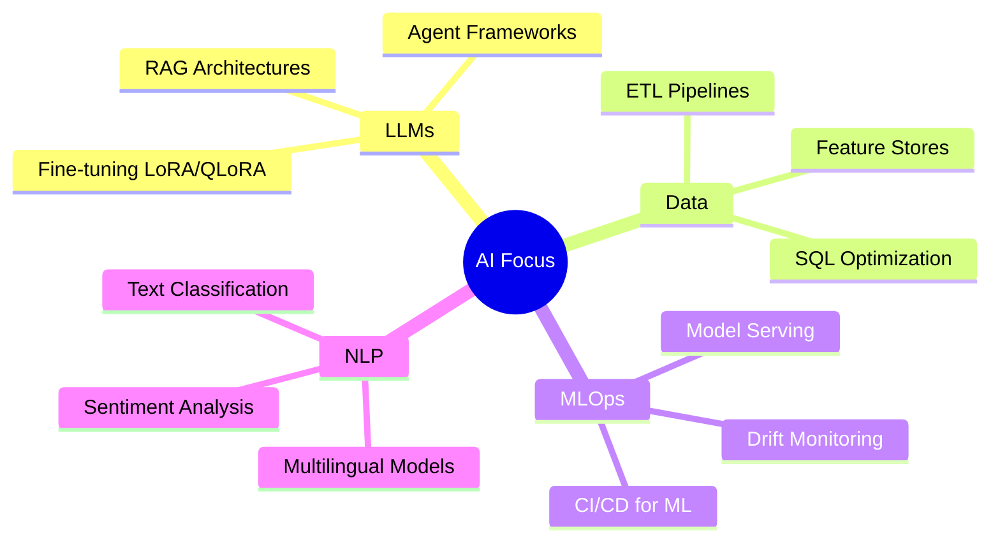

<div align="center">


*Building intelligent systems that turn complex data into real-world impact.*

<br/>

[](https://www.linkedin.com/in/patnaik-avinash-9a5b612aa/)
[](mailto:avinashpatnaik1001@gmail.com)
[](https://avinash-patnaik.github.io/data-workshop/)

<br/>


</div>

## 👨‍💻 About Me

I am an **AI Engineer and Data Scientist** with hands-on experience designing, building, and deploying end-to-end AI/ML systems. My work spans the full pipeline from raw data ingestion and transformation through to model training, evaluation, and production serving. I specialise in applying large language models, NLP techniques, and scalable data engineering practices to solve complex business problems.

- 🌍 Based in **Rome, Italy** working with international clients across Europe and the US
- 🤖 Focused on **LLM-powered applications**, **NLP pipelines**, and **MLOps infrastructure**
- 📊 Experienced in building **ETL pipelines** for structured and unstructured data at scale
- 🚀 Passionate about bridging the gap between **research and production-grade AI systems**
- 🔎 Currently exploring **RAG architectures**, **agent frameworks**, and **LLM fine-tuning**

---
```python
class AIEngineer:
    def __init__(self):
        self.name         = "Avinash"
        self.role         = "AI Engineer & Data Scientist"
        self.location     = "Rome, Italy 🇮🇹"
        self.languages    = ["Python", "SQL", "TypeScript"]
        self.focus        = ["LLMs", "RAG", "NLP", "MLOps", "Data Engineering"]
        self.clients      = "International — Europe & United States"
        self.currently    = "Exploring agent frameworks & LLM fine-tuning"

    def mission(self):
        return "Bridge the gap between AI research and production-grade systems."
```

---

## 🛠️ Tech Stack

### 🐍 Languages


### 🤖 AI / ML Frameworks


### 📦 Data Engineering


### 🗄️ Databases & Vector Stores


### ⚙️ MLOps & DevOps


### ☁️ Cloud Platforms


---

## 🧠 Areas of Expertise

```text
LLMs & Prompt Engineering    ████████████████████░   90%
NLP & Text Analytics         ███████████████████░░   85%
Data Engineering & ETL       ███████████████████░░   85%
MLOps & Pipelines            ████████████████░░░░░   75%
Model Training & Fine-tuning ███████████████░░░░░░   70%
```

---

## 🔬 What I Work On

### 🤖 LLMs & Prompt Engineering
Designing and deploying LLM-powered applications using OpenAI, Anthropic, and open-source models. Building **RAG pipelines**, **agent workflows**, and **tool-calling integrations** with LangChain and LlamaIndex. Evaluating model outputs and implementing prompt optimization strategies for production reliability.

### 📊 Data Engineering & ETL
Architecting scalable ETL pipelines for structured and unstructured data, including multilingual text processing, encoding normalization, and schema validation. Experienced with both batch and streaming data workflows delivering clean, analytics-ready datasets to downstream consumers.

### 🔤 NLP & Text Analytics
End-to-end NLP pipeline development covering tokenization, entity recognition, sentiment analysis, classification, and semantic similarity. Applied experience in processing Italian and multilingual corpora, including call center transcripts and survey response data.

### ⚙️ MLOps & Pipelines
Building production ML infrastructure with a focus on reproducibility, observability, and reliability. Covers experiment tracking, model versioning, automated retraining, CI/CD for ML, and Kubernetes-based model serving with drift monitoring.



---

## 📫 Get In Touch

I am open to consulting engagements, technical collaborations, and AI/ML projects. Feel free to reach out:

| Channel | Link |
|---|---|
| 📧 Email | avinashpatnaik1001@gmail.com |
| 💼 LinkedIn | https://www.linkedin.com/in/patnaik-avinash-9a5b612aa/ |
| 🌐 GitHub | https://github.com/Avinash-patnaik |

---

<div align="center">


*"The goal is to turn data into information, and information into insight."*

</div>
